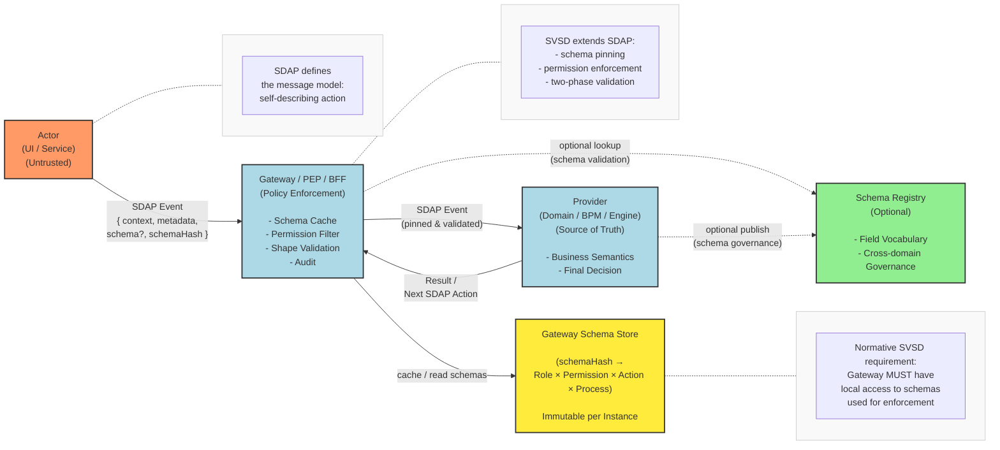

# Security Version Scheme Distribution (SVSD)

## Table of Contents

- [Intent](#intent)
- [Context](#context)
- [Problem](#problem)
- [Solution](#solution-core)
- [Excample Message](#excample-message)
- [Components](#components) 
- [Diagram](#diagram)
- [Invariants](#invariants)
- [Relation to SDAP](#relation-to-sdap)
- [References](#references)
  
## Intent

Provide deterministic, secure, and versioned delivery of action schemas between
producer and consumer in long-running processes. Preserve SDAP flexibility while mitigating
risks of tampering, desynchronization, and unpredictable changes.

## Context

Applicable when all of the following conditions are met:

- Provider acts as the source of truth for process actions;
- A mechanism is needed to describe actions and associated data structures between
  provider and consumer (e.g., dynamic UI rendering from provider schemas or
  backend-to-backend interactions);
- Long-running process instances (days/weeks/months);
- Frontend is **untrusted** and cannot enforce business rules;
- Goal: minimize synchronous releases of UI/backend components.

## Problem

- Risk of client-side schema/payload tampering;
- Schema drift within already running processes;
- Misalignment of permissions between services;
- High load due to frequent transmission of large schemas;
- Lack of traceability of why a transition was executed or rejected;a
- Need to maintain low coupling while ensuring secure data delivery.

## Solution (Core)

- **Schema pinning per process instance**: for each `processInstance + taskId`, the schema is
  bound to a specific `schemaHash` and becomes immutable for that instance.
- **Unified data validation mechanism** on the intermediate service (Gateway/PEP/BFF),
  providing a control point for request legitimacy without participating in business logic.
- **Schema and request legality validation** implemented on both consumer and provider sides.
- **Permission = process-state capability**: ensures data integrity across schema changes in
  different processes.
- **Use of schemaHash** to minimize payload size and validate requests.
- **Role-based model + action-permission mapping**: reduces overhead of maintaining
  centralized rules for schema usage.

## Excample Message
-[**Excample**](docs/excample-message.md)

## Components

- **Provider (Domain Layer)** — source of truth, schema producer, final decision-maker.
- **Gateway (PEP/BFF)** — intermediate service providing access to the provider, validation,
  schema caching, and audit.
- **Durable Store** — stores previously created and transmitted schemas with binding to
  permissions and events to optimize transfers and ensure compatibility.
- **Schema Registry (optional)** — additional stability and governance.
- **Actor (UI-Renderer or Service)** — untrusted renderer sending intents with `schemaHash`.

## Diagram

## Invariants

1. Schema immutable per `(processInstanceId, taskId)`.
2. Any intent must include `schemaHash`; Gateway rejects requests without it.
3. Gateway filters actions based on permissions and returns only allowed ones.
4. Two-phase validation: Gateway (shape+permission) → Provider (semantics).
5. Audit logs: `processId`, `taskId`, `actionId`, `schemaHash`, `userId`, result.
6. Idempotency: actions contain `idempotencyKey (actionId)`.

## Relation to SDAP

SVSD extends SDAP by providing secure and versioned delivery of action schemas. All
SVSD messages conform to the SDAP pattern: they include `context`, `metadata`, `schema`, and
`schemaHash`.
SVSD adds schema pinning per process instance, permission validation, and audit, while maintaining
loose coupling.

## References

- [**Security Permissions**](docs/security-permissions.md)
- [**Schema-Driven Action Propagation (SDAP)**](https://github.com/IVoin-coder/schema-driven-action-propagation)

## License

Distributed under the MIT License. See the `LICENSE` file in the repository for details.

---

**👤 Author**: [Igor Soldatenko]  
**Repository**: https://github.com/IVoin-coder/schema-driven-action-propagation  
**Goal**: Formalize SVSD as an extension of SDAP for secure versioned schema delivery  
**Discussion**: [GitHub Discussions](https://github.com/IVoin-coder/security-version-scheme-distribution)  
**Issues**: [GitHub Issues](https://github.com/IVoin-coder/security-version-scheme-distribution/issues)

